# EzBooking Admin - Web Admin Panel for Event Booking App

**EzBooking Admin** is an event management platform for admins to oversee and manage the entire event ecosystem. Admins can manage users, events, payments, and monitor platform activity.

## Features for Admin

As an **Admin**, you will have access to the following features:

- **User Management**: Admins can view, add, edit, or remove users, including **Organizers** and **Customers**.
- **Event Management**: Admins have the ability to manage all events on the platform, including editing event details, approving/rejecting events, and removing events.
- **Payment and Revenue Monitoring**: View payments made by users, track revenue generated by events, and manage financial details.
- **Ticket Sales Overview**: Admins can view and monitor ticket sales statistics across all events and make necessary adjustments.
- **Role Management**: Admins can assign and manage roles for users, including changing user roles to **Organizer** or **Customer**.

## Tech Stack

- **Frontend**: Flutter Web
- **Backend**: Firebase (Firestore, Authentication)
- **State Management**: Provider
- **Architecture**: Clean Architecture

## Screenshots
<div style="display: flex; gap: 10px;">
  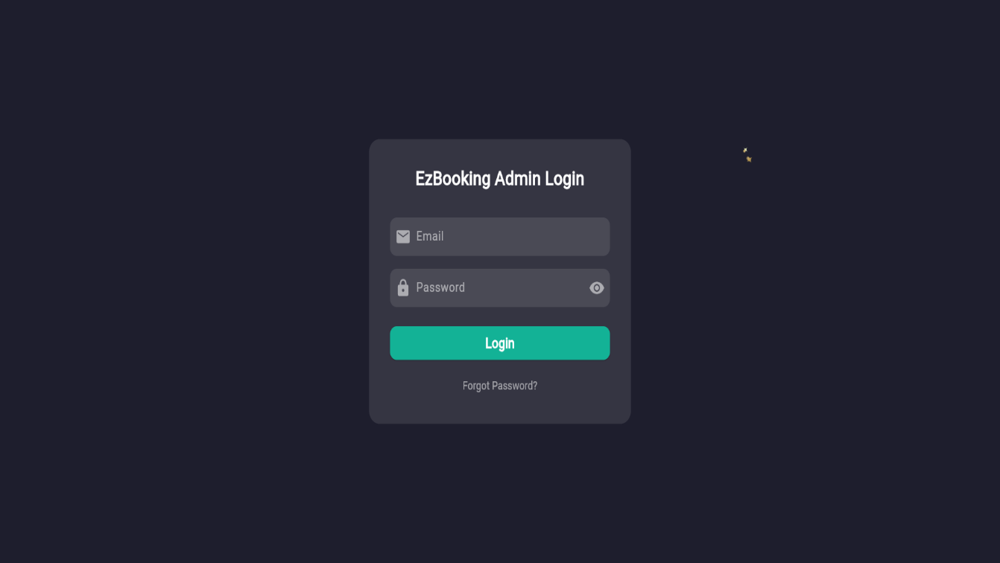
  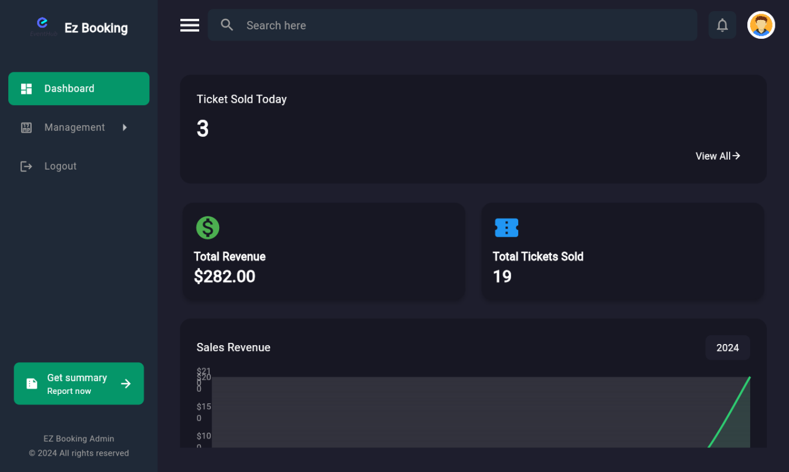
  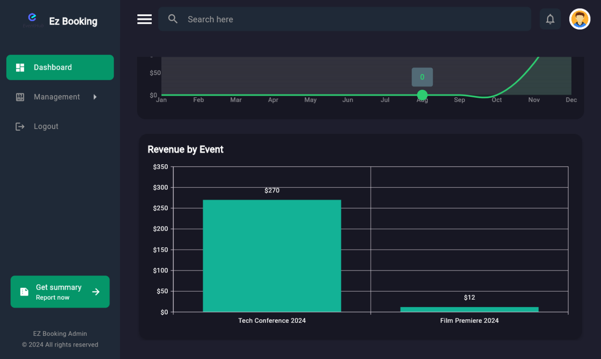
  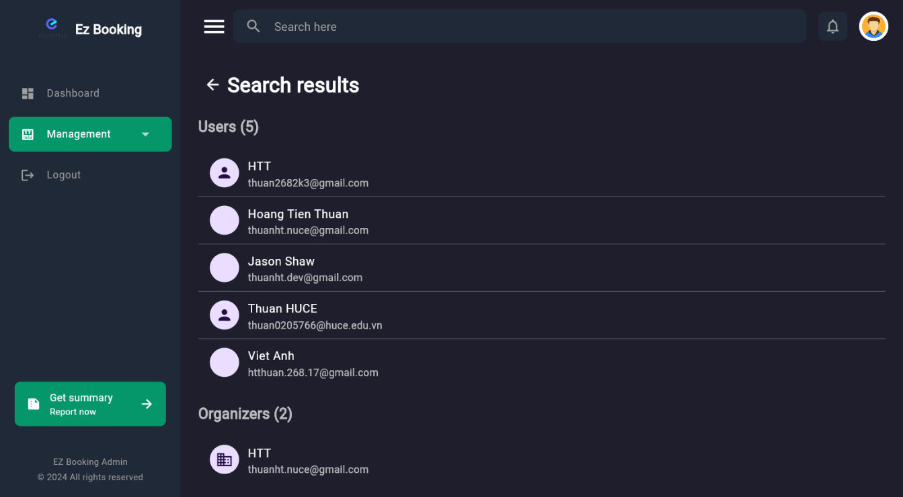
  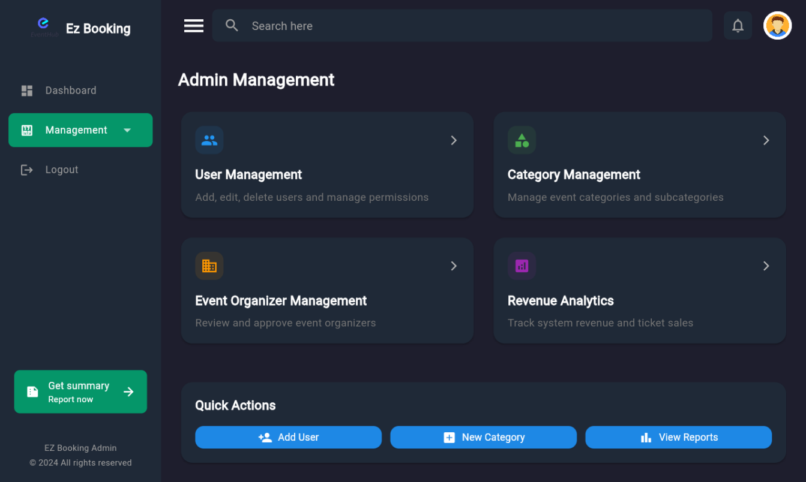
  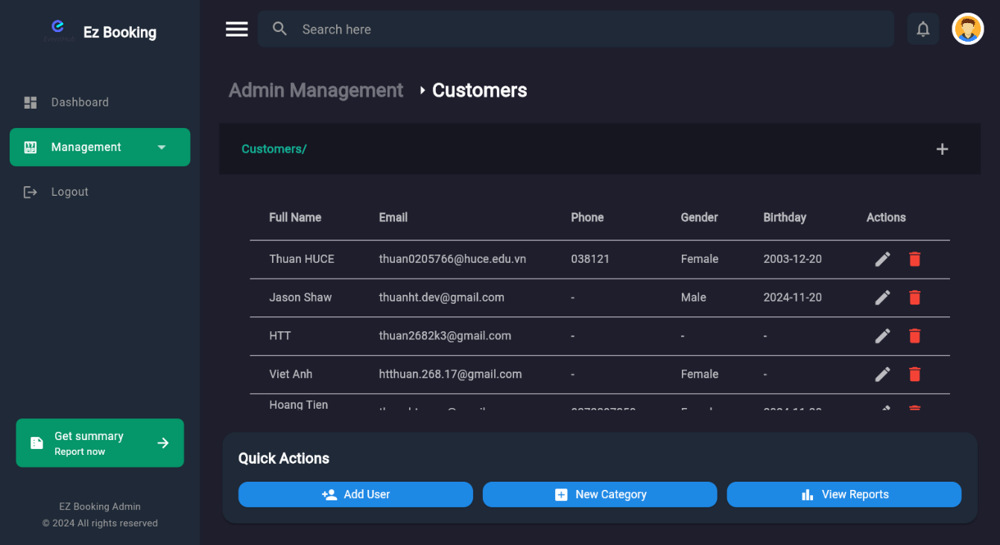
  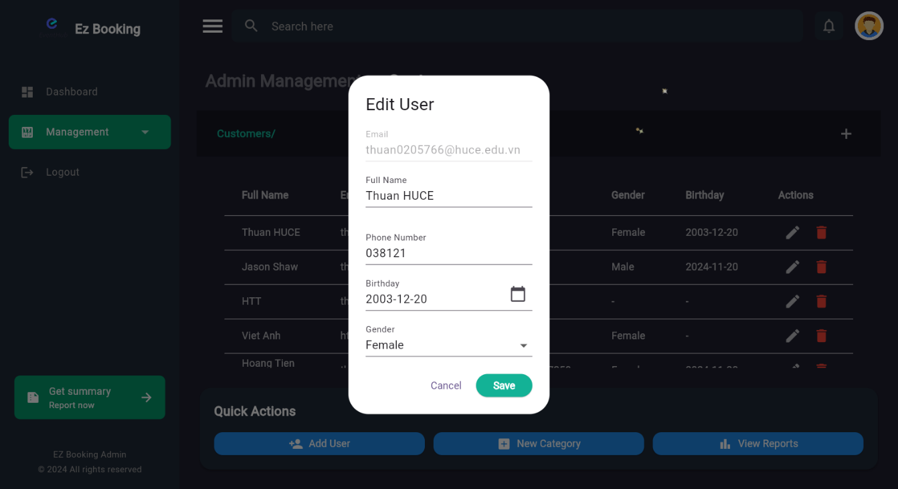
  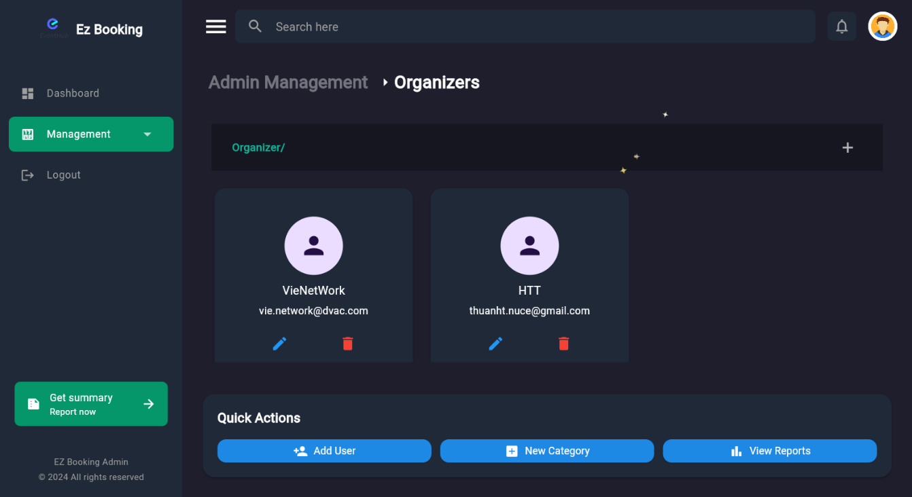
  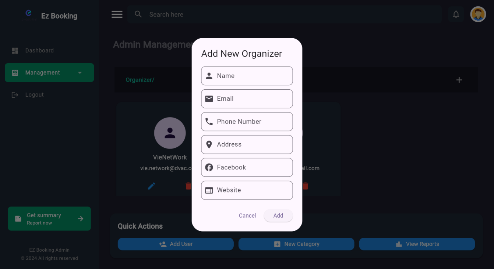
  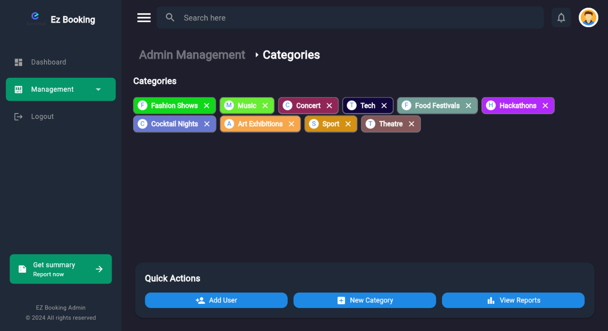
  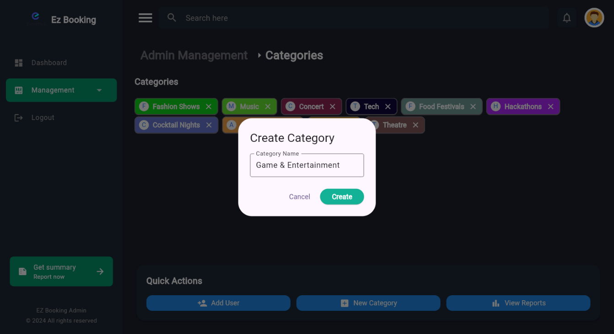
  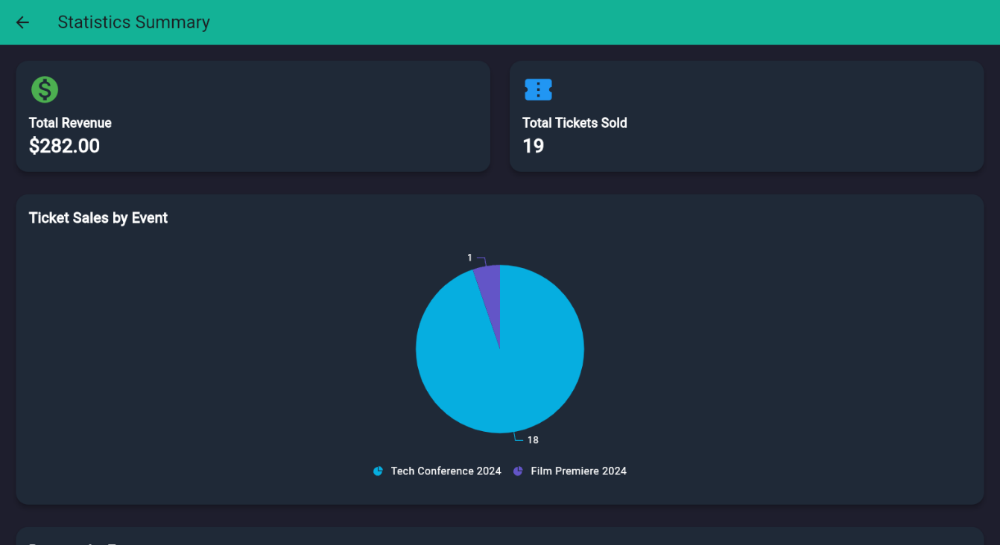
</div>

## Setup

### Prerequisites

- Flutter installed on your machine: [Flutter installation guide](https://flutter.dev/docs/get-started/install)
- Firebase project set up and connected: [Firebase setup guide](https://firebase.google.com/docs/flutter/setup)

### Installation

1. Clone the repository:
   ```bash
   git clone https://github.com/thuanyg/ezbooking_admin.git
   cd oezbooking-app
